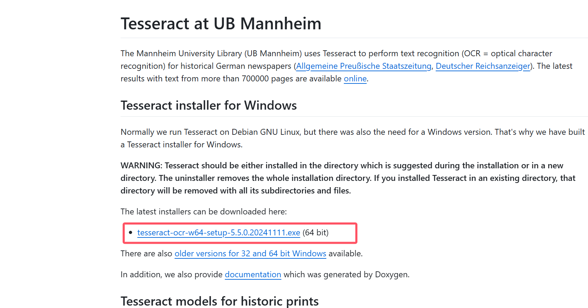
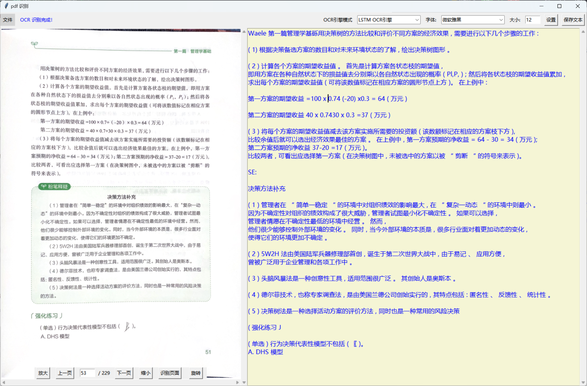

## 程序说明（重点）！！：
目前只兼容window系统，其他系统未进行适配！
需要配合tesseract 使用:
    地址：https://github.com/UB-Mannheim/tesseract/wiki

默认安装即可，该版本安装过程中会自动注入环境变量，无需手动配置。

## 程序配置
### python版本 ：Python 3.12.3
### 安装依赖包
 pip install -r requirements.txt
 
## 程序预览

## 程序介绍
### 快捷键说明：
ctrl - ➕ ：pdf 放大   
ctrl - ➖ ：pdf 缩小   
ctrl - 鼠标滚轮 ：pdf放大或缩小   
ctrl - ←   ：pdf上一页   
ctrl - →   ：pdf下一页   
ctrl - shift - ←   ：当前pdf图片 左旋转90度(逆时针)   
ctrl - shift - →   ：当前pdf图片 右旋转90度(顺时针)   
ctrl - shift - S    ：保存修改后的pdf文件   
ctrl - enter ：识别当前图片内容   
ctrl - s ：保存右侧文本内容   

### 程序缺陷(待解决)
#### ①请点击文件——重新加载PDF来解决下列问题：
如果信息栏出现 红色字体，内容为：”错误,保存PDF操作错误“；
#### ②使用wps 打开当前pdf,另存当前文件名，覆盖原文件 来解决下列问题：
如果①问题依旧存在； 
进入程序，不显示pdf界面，控制台报错；

## 其他
### 导出配置文件
pip list --format=freeze > requirements.txt

### 如果对你有帮助，请我喝瓶可乐
